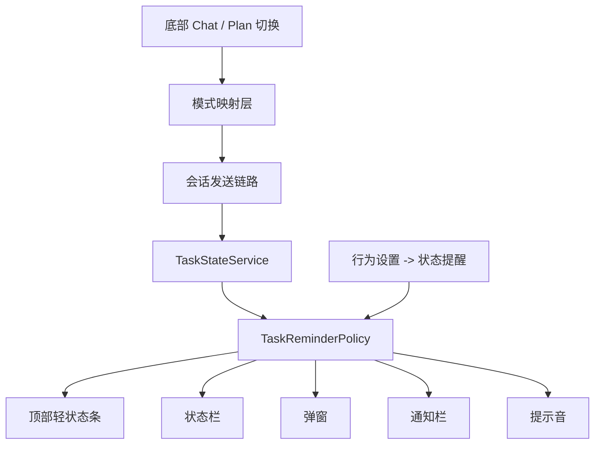
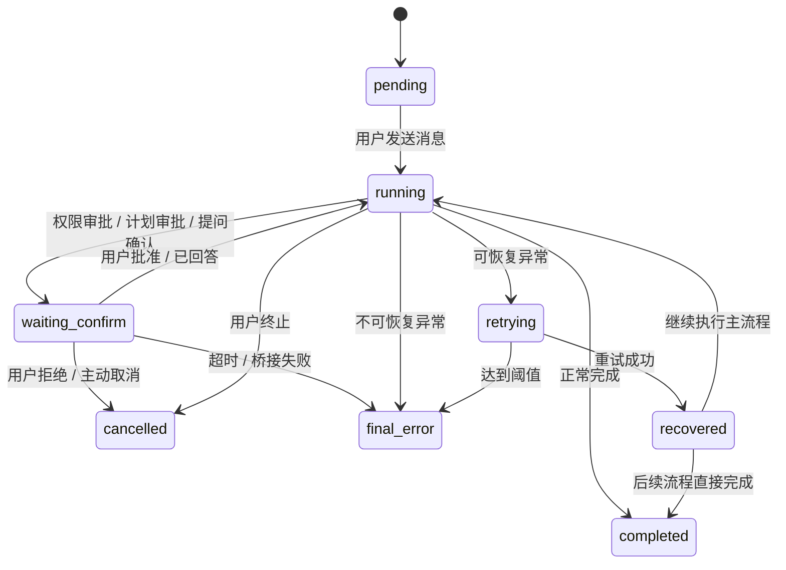
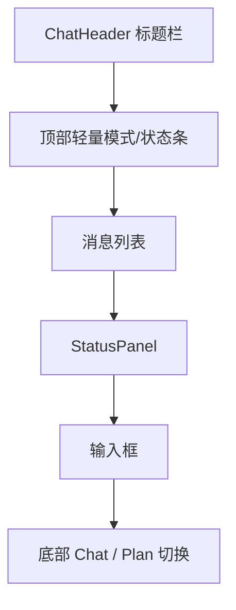
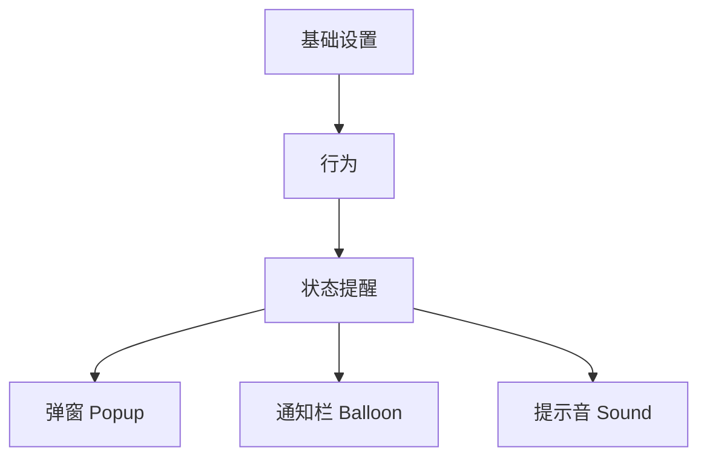
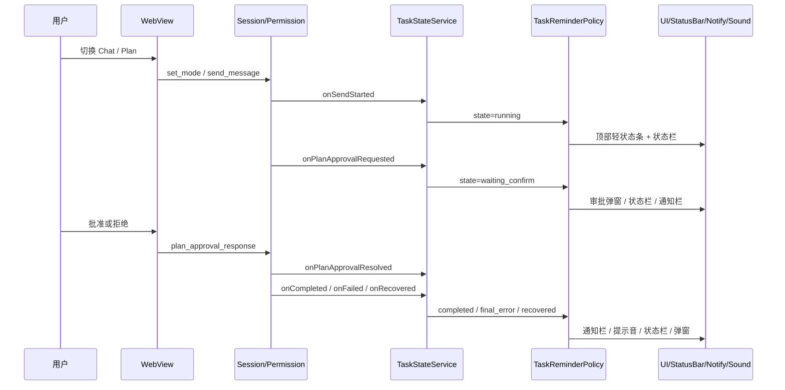
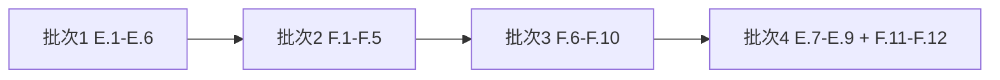

# Plan 模式产品化与任务状态提醒设计

## 1. 背景

当前项目已经具备 `plan` 相关的底层基础能力，但仍停留在“局部可用、产品化不完整”的阶段：

- 前端 `PermissionMode` 已支持 `plan`
- `PlanApprovalDialog` 与 `PermissionHandler` 已经接通基础审批链路
- `codex` provider 下已存在 `plan -> default` 的兜底降级逻辑
- 状态栏与提示音已有基础实现，分别由 `ClaudeStatusBarWidget`、`ClaudeNotifier`、`SoundNotificationService` 承担

但从产品视角看，当前仍缺少以下关键能力：

1. 用户可直接感知的 `Chat / Plan` 模式切换入口
2. 顶部轻量模式/状态提示
3. `plan` 审批通过、拒绝、超时、回退的完整闭环
4. 面向 `waiting_confirm / retrying / recovered / final_error / completed` 的统一任务状态模型
5. 面向弹窗、通知栏、状态栏、提示音的统一提醒策略
6. “基础设置 -> 行为 -> 状态提醒”总配置组
7. 旧 `soundNotification` 配置向新提醒模型的兼容迁移

本设计面向以下两份外部分析文档中的 `E.1-E.9`、`F.1-F.12` 两组任务，目标是在当前代码基础上完成正式产品化落地：

- `/Users/caihanyuan/workspace/foam-daily-notes/notes/work/CC-GUI增强/新功能点/04-Plan模式与任务状态提醒方案.md`
- `/Users/caihanyuan/workspace/foam-daily-notes/notes/work/CC-GUI增强/新功能点/05-实施计划与任务清单.md`

## 2. 目标

### 2.1 功能目标

- 在聊天输入区底部增加正式的 `Chat / Plan` 切换入口
- 在顶部增加一条轻量模式/状态条，不喧宾夺主，但能持续反馈当前运行态
- 打通 `plan` 模式的审批闭环，包括批准、拒绝、超时、回退与 provider 兼容提示
- 建立统一 `TaskState` 与 `TaskStateService`
- 建立统一 `TaskReminderPolicy`，让提醒决策从 UI 逻辑中抽离
- 在“基础设置 -> 行为”中建立统一“状态提醒”配置组
- 兼容旧版提示音配置，并通过迁移进入新配置模型

### 2.2 产品目标

- 平时弱打扰：用户默认只看到底部模式切换、顶部轻状态条、状态栏弱提示
- 关键节点强闭环：仅在 `waiting_confirm`、`final_error` 这类需要动作或强感知的状态上进行强提醒
- 保持当前聊天主流程为第一优先级，不让“模式”与“提醒系统”压过主内容

## 3. 非目标

本期不包含以下内容：

- 多项目工作区的统一上下文管理能力
- 远程协同通道，如飞书/Telegram/手机回执等链路
- 重新设计整个聊天页布局
- 修改 provider 协议定义本身，尤其不重写现有 `set_mode / get_mode` 基础桥接协议
- 为 `codex` 真正新增完整 `plan` 能力；本期仅提供禁用态/降级提示与后端兜底兼容

## 4. 现状分析

### 4.1 已有基础能力

#### Plan 模式相关

- `webview/src/components/ChatInputBox/types.ts`
  - `PermissionMode` 已包含 `plan`
- `webview/src/components/ChatInputBox/selectors/ModeSelect.tsx`
  - `codex` 下已隐藏 `plan`
- `webview/src/hooks/useModelProviderState.ts`
  - 已支持 `claudePermissionMode` / `codexPermissionMode`
  - 已包含 `codex` 下 `plan -> default` 的恢复与发送兜底
- `webview/src/hooks/useMessageSender.ts`
  - 发送时已包含 `requestedMode` 与 `effectiveMode` 逻辑
- `webview/src/hooks/windowCallbacks/registerCallbacks/usageModeCallbacks.ts`
  - 已包含 `window.onModeChanged` / `window.onModeReceived` 回显与 `codex` 降级逻辑
- `webview/src/components/PlanApprovalDialog.tsx`
  - 已有基础 Plan 审批弹窗
- `webview/src/hooks/useDialogManagement.ts`
  - 已支持 `PlanApprovalDialog` 的打开、队列、批准、拒绝处理
- `src/main/java/com/github/claudecodegui/handler/PermissionHandler.java`
  - 已支持 `plan_approval_response` 与 `showPlanApprovalDialog`
- `src/main/java/com/github/claudecodegui/permission/PermissionService.java`
  - 已支持 PlanApproval 请求处理与路由

#### 提醒能力相关

- `src/main/java/com/github/claudecodegui/notifications/ClaudeNotifier.java`
  - 已有成功、失败、警告、状态栏模式同步、任务完成提示音
- `src/main/java/com/github/claudecodegui/notifications/ClaudeStatusBarWidget.java`
  - 已有状态、模型、模式、agent 的状态栏展示
- `src/main/java/com/github/claudecodegui/util/SoundNotificationService.java`
  - 已有声音资源、IDE 聚焦判断、测试播放能力
- `src/main/java/com/github/claudecodegui/handler/SoundSettingsHandler.java`
  - 已有提示音配置的 bridge 读写能力
- `src/main/java/com/github/claudecodegui/settings/CodemossSettingsService.java`
  - 已有旧 `soundNotification` 配置存储
- `webview/src/components/settings/BasicConfigSection/BehaviorTab.tsx`
  - 已有状态栏开关与提示音配置 UI
- `webview/src/components/settings/hooks/useSettingsBasicActions.ts`
  - 已有提示音配置发送逻辑
- `webview/src/components/settings/hooks/useSettingsWindowCallbacks.ts`
  - 已有提示音配置回显逻辑

### 4.2 当前主要缺口

1. `plan` 仍然被当作一个隐藏在 `PermissionMode` 中的模式，缺少正式产品级入口
2. 顶部没有轻量模式/任务状态条
3. 缺少统一 `TaskState` 与归因规则
4. 缺少统一提醒策略，当前仅有完成提示音与零散成功/失败提示
5. 设置页中的“提示音”仍是旧模型，尚未升级为“状态提醒”总配置组
6. 缺少对应单元测试与迁移测试

## 5. 设计原则

- 保持与当前代码结构兼容，不直接推翻已有 `permissionMode` 桥接协议
- 通过统一的状态聚合与策略层减少 UI 层判断
- 明确区分“产品视图模式”和“底层 permissionMode”
- 强提醒只用于真正需要动作或强感知的状态
- 旧配置优先兼容迁移，而不是硬切导致丢配置
- 每个模块边界清晰，便于单元测试与后续扩展到远程协同

## 6. 总体架构



整体拆分为 6 个子模块：

1. `M1. Plan 模式交互层`
2. `M2. Plan 审批闭环层`
3. `M3. 任务状态聚合层`
4. `M4. 提醒策略与通道层`
5. `M5. 设置与配置模型层`
6. `M6. 顶部轻量状态展示层`

## 7. 模块设计

### 7.1 M1. Plan 模式交互层

#### 目标

把当前“隐藏在 permissionMode 内的 plan”升级为用户可感知的正式 `Chat / Plan` 切换。

#### 责任边界

- 负责用户切换模式与 provider 兼容展示
- 负责把 UI 模式映射到当前 `permissionMode`
- 不负责审批结果流转
- 不负责提醒策略决策

#### 主要文件

- `webview/src/components/ChatInputBox/ButtonArea.tsx`
- `webview/src/components/ChatInputBox/ChatInputBoxFooter.tsx`
- `webview/src/components/ChatInputBox/selectors/ModeSelect.tsx`
- `webview/src/hooks/useModelProviderState.ts`
- `webview/src/hooks/useMessageSender.ts`
- `webview/src/hooks/windowCallbacks/registerCallbacks/usageModeCallbacks.ts`

#### 设计说明

产品概念上，模式分为两层：

- 第一层：`Chat / Plan`
- 第二层：仅对 `Chat` 有意义的执行策略
  - `default`
  - `acceptEdits`
  - `bypassPermissions`

实现上，为避免大改桥接协议，本期仍沿用 `permissionMode` 作为底层 canonical 值：

- `Chat + default` -> `default`
- `Chat + acceptEdits` -> `acceptEdits`
- `Chat + bypassPermissions` -> `bypassPermissions`
- `Plan` -> `plan`

对 `codex` provider：

- UI 上显示 `Plan` 禁用态或不可用态说明
- 发送链路保留现有 `plan -> default` 兜底逻辑
- 回显逻辑同样保留 `codex` 下 `plan -> default` 的后端兜底

### 7.2 M2. Plan 审批闭环层

#### 目标

把 `plan` 模式下的审批链路从“可弹窗”升级为“产品闭环”。

#### 责任边界

- 负责展示审批请求与处理用户决策
- 负责批准、拒绝、超时、队列处理
- 负责把审批请求映射为任务状态层输入
- 不负责提醒通道策略

#### 主要文件

- `webview/src/components/PlanApprovalDialog.tsx`
- `webview/src/hooks/useDialogManagement.ts`
- `webview/src/hooks/windowCallbacks/registerCallbacks/permissionCallbacks.ts`
- `src/main/java/com/github/claudecodegui/handler/PermissionHandler.java`
- `src/main/java/com/github/claudecodegui/permission/PermissionService.java`

#### 设计说明

- 沿用现有 `PlanApprovalDialog`
- 保留 `requestId + approved + targetMode` 的响应结构
- 增补超时后状态回退和 UI 提示
- 如果审批弹窗已打开，则 `waiting_confirm` 的强提醒不再重复触发第二个强提醒弹窗

### 7.3 M3. 任务状态聚合层

#### 目标

新增统一 `TaskStateService`，将会话、权限、计划审批、恢复、结束等事件映射为统一状态。

#### 建议新增文件

- `src/main/java/com/github/claudecodegui/taskstate/TaskState.java`
- `src/main/java/com/github/claudecodegui/taskstate/TaskStateEvent.java`
- `src/main/java/com/github/claudecodegui/taskstate/TaskStateSnapshot.java`
- `src/main/java/com/github/claudecodegui/taskstate/TaskStateService.java`

#### 状态定义

- `pending`
- `running`
- `waiting_confirm`
- `retrying`
- `recovered`
- `final_error`
- `completed`
- `cancelled`

#### 状态机



#### 归因规则

| 状态 | 典型来源 | 是否强提醒 |
| --- | --- | --- |
| `pending` | 前端已发送，后端尚未完全开始 | 否 |
| `running` | 正常执行、stream 中、tool 执行中 | 否 |
| `waiting_confirm` | 权限确认、`ask_user_question`、`plan_approval` | 是 |
| `retrying` | 命中可恢复异常并自动重试 | 否 |
| `recovered` | 重试成功，流程恢复 | 否 |
| `final_error` | 不可恢复错误或达到重试阈值 | 是 |
| `completed` | 正常完成 | 否 |
| `cancelled` | 用户主动停止或明确拒绝 | 否 |

#### 事件来源

- `SessionHandler` / `SessionSendService`：发送开始、完成、失败
- `PermissionHandler` / `PermissionService`：权限与计划审批等待、批准、拒绝、超时
- 未来可接入：远程协作服务、移动端回执

### 7.4 M4. 提醒策略与通道层

#### 目标

新增 `TaskReminderPolicy`，统一决定任务状态是否触发弹窗、通知栏、状态栏、提示音。

#### 建议新增文件

- `src/main/java/com/github/claudecodegui/taskstate/TaskReminderPolicy.java`
- `src/main/java/com/github/claudecodegui/taskstate/TaskReminderDispatcher.java`
- `src/main/java/com/github/claudecodegui/notifications/ClaudeBalloonNotifier.java`（如当前仓库无现成通知栏封装）

#### 复用文件

- `src/main/java/com/github/claudecodegui/notifications/ClaudeNotifier.java`
- `src/main/java/com/github/claudecodegui/notifications/ClaudeStatusBarWidget.java`
- `src/main/java/com/github/claudecodegui/util/SoundNotificationService.java`

#### 通道定义

- `popup`：弹窗，主要用于 `waiting_confirm`、`final_error`
- `balloon`：通知栏/balloon，主要用于 `completed`、`recovered`、`final_error`
- `status_bar`：状态栏，所有关键状态均可弱提示
- `sound`：提示音，默认用于 `completed`，可扩展到 `recovered`、`final_error`

#### 去重策略

- 如果当前已有对应审批弹窗打开，则 `waiting_confirm` 不再通过 `TaskReminderDialog` 重复弹出强提醒
- 同一任务同一状态在短时间内不重复发通知栏
- 状态栏始终允许更新，但 tooltip 内容应显示最新快照

### 7.5 M5. 设置与配置模型层

#### 目标

把当前零散的提示音设置升级为统一的“状态提醒”配置组。

#### 主要文件

- `src/main/java/com/github/claudecodegui/settings/CodemossSettingsService.java`
- `src/main/java/com/github/claudecodegui/handler/SoundSettingsHandler.java`
- `src/main/java/com/github/claudecodegui/handler/SettingsHandler.java`
- `webview/src/components/settings/BasicConfigSection/BehaviorTab.tsx`
- `webview/src/components/settings/BasicConfigSection/index.tsx`
- `webview/src/components/settings/hooks/useSettingsBasicActions.ts`
- `webview/src/components/settings/hooks/useSettingsWindowCallbacks.ts`
- `webview/src/components/settings/index.tsx`

#### 新配置模型

```json
{
  "taskReminder": {
    "popup": {
      "enabled": true,
      "states": ["waiting_confirm", "final_error"],
      "onlyWhenIdeUnfocused": false
    },
    "balloon": {
      "enabled": true,
      "states": ["completed", "recovered", "final_error"],
      "onlyWhenIdeUnfocused": true
    },
    "sound": {
      "enabled": true,
      "states": ["completed"],
      "onlyWhenIdeUnfocused": true,
      "selectedSound": "default",
      "customSoundPath": ""
    }
  }
}
```

#### 迁移规则

从旧配置 `soundNotification` 迁移到新配置 `taskReminder.sound`：

- `soundNotification.enabled` -> `taskReminder.sound.enabled`
- `soundNotification.onlyWhenUnfocused` -> `taskReminder.sound.onlyWhenIdeUnfocused`
- `soundNotification.selectedSound` -> `taskReminder.sound.selectedSound`
- `soundNotification.customSoundPath` -> `taskReminder.sound.customSoundPath`

迁移策略：

- 首次读取时，如果不存在 `taskReminder` 但存在旧 `soundNotification`，自动补齐新结构
- 新结构写回后，后续优先读取 `taskReminder`
- 保留一版旧 bridge 消息兼容，避免设置页联动期间出现空值

### 7.6 M6. 顶部轻量状态展示层

#### 目标

满足“顶部只加一条很轻的工作区/模式条”的产品方向，但默认聚焦当前项目聊天，不让其成为主视图。

#### 主要文件

- `webview/src/App.tsx`
- `webview/src/components/ChatHeader/ChatHeader.tsx`
- 建议新增 `webview/src/components/ChatModeStrip/ChatModeStrip.tsx`

#### 展示内容

- 当前模式：`Chat` / `Plan`
- 当前任务状态：`running / waiting_confirm / retrying / recovered / completed / final_error`
- 当前 provider：必要时以弱文案显示，不要求长期高亮

#### 视觉原则

- 条高尽量薄
- 不采用大面积底色卡片
- 仅在有明确状态时显示内容，减少常驻噪音

## 8. UI 设计

### 8.1 聊天页结构



### 8.2 底部模式切换

- 位置：输入框底部左侧，与现有模式/模型区域同层
- 形态：优先采用 `Chat / Plan` 二段切换，而不是仅在 dropdown 中暴露 `plan`
- 行为：
  - 切到 `Plan` 时，底层写入 `permissionMode = plan`
  - 切到 `Chat` 时，恢复当前 provider 最近一次非 `plan` 的聊天执行模式
- `codex` provider：
  - 显示 `Plan` 禁用态或不可用提示
  - 保留后端 `plan -> default` 兜底逻辑，避免桥接异常

### 8.3 顶部轻量状态条

建议展示格式：

- 左侧：`Mode: Chat` / `Mode: Plan`
- 右侧：`Waiting for approval` / `Retrying` / `Recovered` / `Completed` / `Failed`

状态色建议：

- `running`：蓝灰
- `waiting_confirm`：琥珀
- `retrying`：橙色
- `recovered`：青绿
- `completed`：绿色
- `final_error`：红色

### 8.4 弹窗设计

#### PlanApprovalDialog

- 继续作为 `plan` 审批的主弹窗
- 展示计划内容、执行模式选择、批准与拒绝
- 保留队列与超时能力

#### TaskReminderDialog

- 新增独立提醒弹窗，用于状态提醒
- 只处理：
  - `waiting_confirm`
  - `final_error`
- 动作建议：
  - `waiting_confirm`：查看并处理、打开聊天窗口、稍后处理
  - `final_error`：查看详情、重试、打开会话、忽略

## 9. 设置页设计

### 9.1 信息架构



### 9.2 配置项设计

| 组 | 子项 | 默认状态 | 默认适用状态 | 备注 |
| --- | --- | --- | --- | --- |
| 状态提醒 | 弹窗 | 开启 | `waiting_confirm`、`final_error` | 强提醒，面向动作确认与最终失败 |
| 状态提醒 | 通知栏 | 开启 | `completed`、`recovered`、`final_error` | 面向结果感知 |
| 状态提醒 | 提示音 | 开启 | `completed` | 继承旧习惯，可扩展 |

### 9.3 展开策略

- “状态提醒”总组默认展开
- `弹窗 / 通知栏 / 提示音` 子项可折叠
- 子项标题行显示摘要，例如：
  - `弹窗：已开启（waiting_confirm, final_error）`
  - `通知栏：已开启（completed, recovered, final_error）`
  - `提示音：已开启（completed，仅IDE失焦）`

## 10. 数据流



## 11. 风险与应对

### 11.1 模式语义拆分风险

风险：当前系统仍以 `permissionMode` 为主，若直接引入独立 `usageMode` 协议，回归成本较高。

应对：本期仅引入“产品视图层”的 `Chat / Plan` 概念，底层 canonical 值仍然是现有 `permissionMode`。

### 11.2 重复提醒风险

风险：`PlanApprovalDialog` 与 `TaskReminderDialog` 都可能在 `waiting_confirm` 时触发。

应对：由 `TaskReminderPolicy` 统一去重，已有审批弹窗打开时不重复弹强提醒。

### 11.3 配置迁移风险

风险：旧用户已有提示音配置，若切到新模型可能丢失。

应对：读时迁移、写时新结构，并补迁移单测。

### 11.4 provider 兼容风险

风险：`codex` 当前不支持正式 `plan`，但前端如果暴露入口会造成误解。

应对：UI 上明确禁用态或降级提示，发送链路与回显链路保留现有兜底。

### 11.5 通知栏实现缺口

风险：当前仓库未发现现成 balloon 通知统一封装。

应对：新增独立通知适配层，避免 IntelliJ API 散落在业务代码中。

## 12. 测试策略

### 12.1 前端单测

- `E.7`
  - `ModeSelect.tsx` / `ButtonArea.tsx` 的 `Chat / Plan` 切换、禁用态与 provider 可用态
- `E.8`
  - `useMessageSender.ts` / `useModelProviderState.ts` / `usageModeCallbacks.ts` 的模式透传、恢复、`codex -> default` 降级
- `E.9`
  - `PlanApprovalDialog.tsx` / `useDialogManagement.ts` 的批准、拒绝、超时、队列处理
- `F.12`
  - `BehaviorTab.tsx` / `useSettingsBasicActions.ts` / `useSettingsWindowCallbacks.ts` 的提醒配置回显、保存与多选状态

### 12.2 Java 单测

- `F.11`
  - `TaskReminderPolicy` 的通道决策测试
  - `CodemossSettingsService` 的旧配置迁移测试
  - `SoundSettingsHandler` 的新旧桥接兼容测试
- 建议补充：
  - `TaskStateService` 状态归因测试

### 12.3 冒烟验证

- Claude provider 下 `Chat / Plan` 切换
- Codex provider 下 `Plan` 禁用/降级提示
- Plan 审批通过、拒绝、超时
- `completed / waiting_confirm / final_error` 的提醒通道联动
- 设置页保存与重开回显
- 旧 `soundNotification` 配置升级后行为一致

## 13. 任务映射

### E. Plan 模式产品化

- `E.1` 在输入框底部增加 `Chat / Plan` 切换
- `E.2` 发送链路显式透传会话模式，并与 provider 切换保持同步
- `E.3` 将 plan 模式与现有 `PlanApprovalDialog` 正式打通
- `E.4` 在顶部轻量状态条、状态栏与 StatusPanel 中显示当前模式
- `E.5` 为 `codex` provider 增加 `Plan` 禁用态或降级提示
- `E.6` 覆盖 plan 拒绝、超时、回退到 chat 的状态处理
- `E.7` 补 `ModeSelect.tsx` / `ButtonArea.tsx` 的 `Chat / Plan` 切换与 provider 可用态单元测试
- `E.8` 补 `useMessageSender.ts` / `useModelProviderState.ts` / `usageModeCallbacks.ts` 的模式透传与 `codex -> default` 降级测试
- `E.9` 补 `PlanApprovalDialog.tsx` / `useDialogManagement.ts` 的 plan 审批通过、拒绝、超时测试

### F. 任务状态提醒

- `F.1` 设计统一 `TaskState` 枚举与事件模型
- `F.2` 统一 `pending / running / waiting_confirm / retrying / recovered / final_error / completed / cancelled` 的归因规则
- `F.3` 实现 `TaskStateService` 聚合会话、权限、工具与 stream 事件
- `F.4` 实现 `TaskReminderPolicy`，决定弹窗、balloon、状态栏和声音策略
- `F.5` 新增 `TaskReminderDialog` 与动作协议
- `F.6` 在“设置页 -> 基础设置 -> 行为”中新增 `状态提醒` 总配置组，统一承接弹窗、通知栏、提示音
- `F.7` 为 `状态提醒 > 弹窗 / 通知栏 / 提示音` 三个子项提供独立开关、适用状态多选与附加条件配置
- `F.8` 将现有“任务完成提示音 / 仅在 IDE 未聚焦时播放”旧配置迁移到 `状态提醒 > 提示音`
- `F.9` 打通 `waiting_confirm / retrying / recovered / final_error / completed` 的通道映射策略
- `F.10` 覆盖弹窗、通知栏、提示音三类通道组合配置下的提醒闭环
- `F.11` 补 `TaskReminderPolicy` / `CodemossSettingsService` / `SoundSettingsHandler` 的提醒策略与配置迁移单元测试
- `F.12` 补 `BehaviorTab.tsx` / `useSettingsBasicActions.ts` / `useSettingsWindowCallbacks.ts` 的提醒配置回显与保存测试

## 14. 分阶段实施建议



### 批次 1：Plan 模式产品化

- 先完成底部 `Chat / Plan`、顶部轻量状态条、Plan 审批闭环、Codex 禁用/降级、异常回退

### 批次 2：统一状态与提醒基础层

- 建立 `TaskState`、`TaskStateService`、`TaskReminderPolicy`、`TaskReminderDialog`

### 批次 3：设置与通道接通

- 完成“状态提醒”设置总组、旧配置迁移、弹窗/通知栏/提示音的通道映射

### 批次 4：测试与收口

- 补齐前端与 Java 单测
- 完成迁移测试、回显测试、冒烟验证
- 同步更新 `04` 与 `05` 的勾选状态

## 15. 结论

本设计建议在保持现有 `permissionMode` 桥接兼容的前提下，引入更清晰的产品层模式表达、统一任务状态模型与提醒策略层。这样既能完成本期 `E.1-E.9`、`F.1-F.12` 的产品化目标，也为后续远程协同、移动端状态同步等能力留下清晰扩展点。
